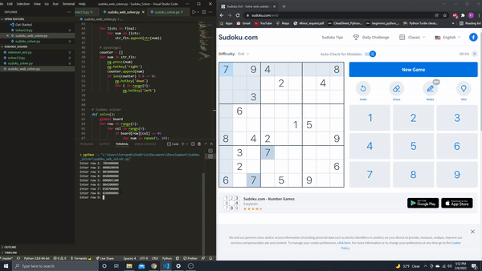

# autosudoku
A program that automates the solving of web-based sudoku puzzles.

## Example
### Step 1
Run the program and open a web-based sudoku puzzle.
### Step 2
Enter the puzzle into the program.
```bash
Enter row 1: 000400190
Enter row 2: 030000860
Enter row 3: 007083500
Enter row 4: 000008600
Enter row 5: 805100000
Enter row 6: 020000350
Enter row 7: 081040000
Enter row 8: 000070000
Enter row 9: 040250000
```
### Step 3
Place the cursor in the first cell of the puzzle (top left) and watch the program solve the puzzle.
